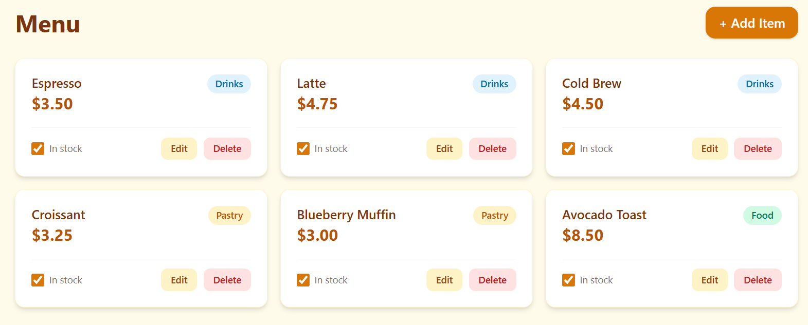
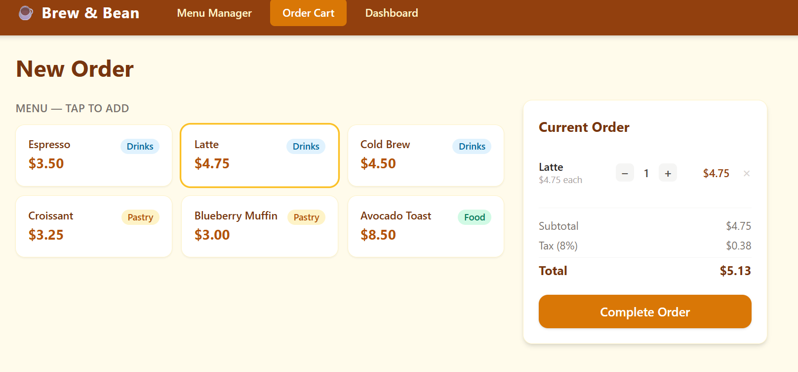
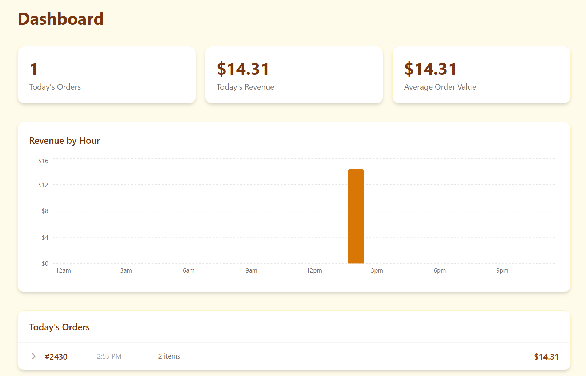

# ☕ Brew & Bean — Order Manager

**Live demo: [brew-and-bean-six.vercel.app](https://brew-and-bean-six.vercel.app)**

A lightweight café management web app built for a small business client. Staff can manage the menu, build customer orders, and review same-day sales performance — all from a single browser tab with no backend required. Data is persisted in `localStorage`, so the app works offline, survives page refreshes, and deploys as a pure static site.

## Features

- **Menu Manager** — add, edit, and delete menu items (Drinks, Food, Pastry); toggle in-stock status; changes persist across sessions
- **Order Cart** — browse in-stock items, build an order with quantity controls, automatic 8% tax, complete orders with a success toast
- **Dashboard** — live stats for today's orders and revenue, hourly revenue bar chart, expandable order history, and a data-reset utility
- **Seeded defaults** — six starter menu items load automatically on first visit
- **Fully offline** — no API calls; all state lives in the browser's localStorage

## Tech Stack

- **React 18** — UI components and state management
- **Vite** — dev server and production bundler
- **Tailwind CSS** — utility-first styling
- **Recharts** — bar chart for hourly revenue
- **localStorage** — client-side persistence (no database required)

## Getting Started

```bash
npm install
npm run dev
```

Open [http://localhost:5173](http://localhost:5173) in your browser. To build for production: `npm run build`.

## AI Development Approach

This project was built in collaboration with an AI coding assistant. The collaboration model emphasized human-led design with AI-led implementation:

- **Business-context-first prompts** — every prompt opened with the client scenario ("a small café that needs to manage their menu and take orders") before naming any technical work, producing more cohesive components and on-brand copy than generic CRUD framing.
- **Data contract defined before UI** — the order shape (id, timestamp, items, subtotal, tax, total) and storage keys were specified up front, so the dashboard read clean, consistent data instead of reconciling two improvised structures.
- **Explicit scope-limit syntax** — prompts named what *not* to build ("do NOT add features yet — just the skeleton") to prevent speculative abstractions and partial implementations.
- **Six-component prompt decomposition** — the build was split across six focused prompts (scaffold, menu, cart, dashboard, polish, deploy), each scoping the AI to a single component to keep its working memory focused and minimize cross-component contamination.

## Screenshots

### Menu Manager


### Order Cart


### Dashboard

